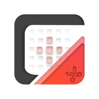
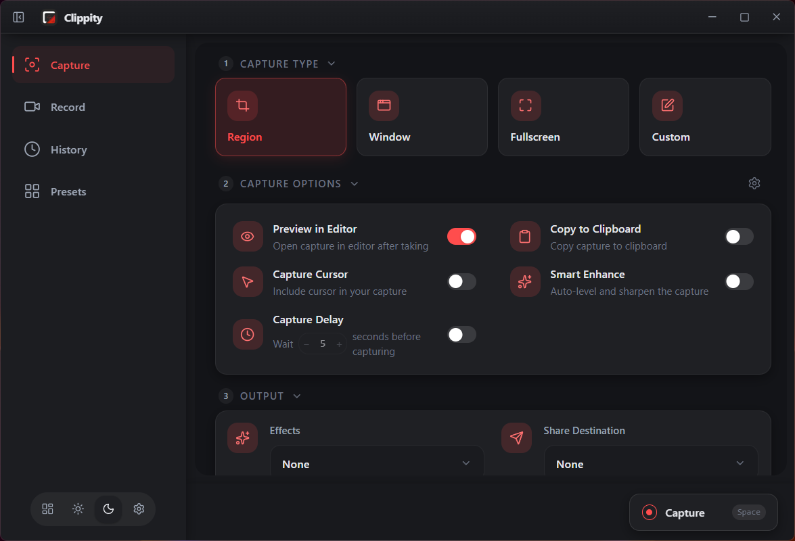
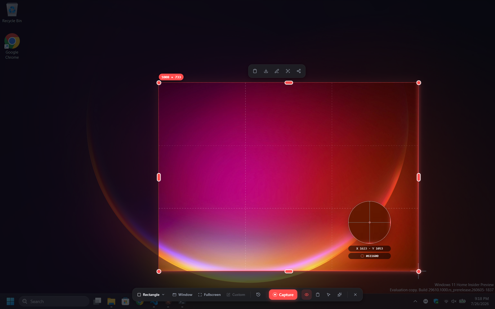
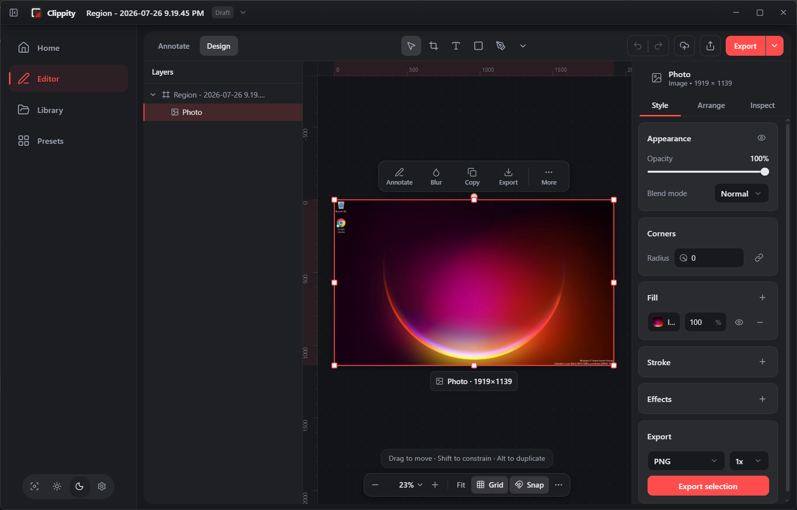
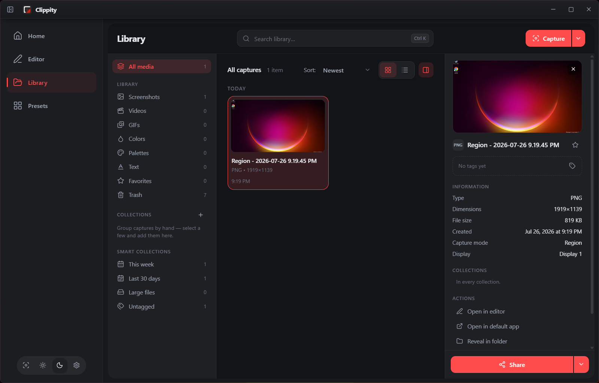
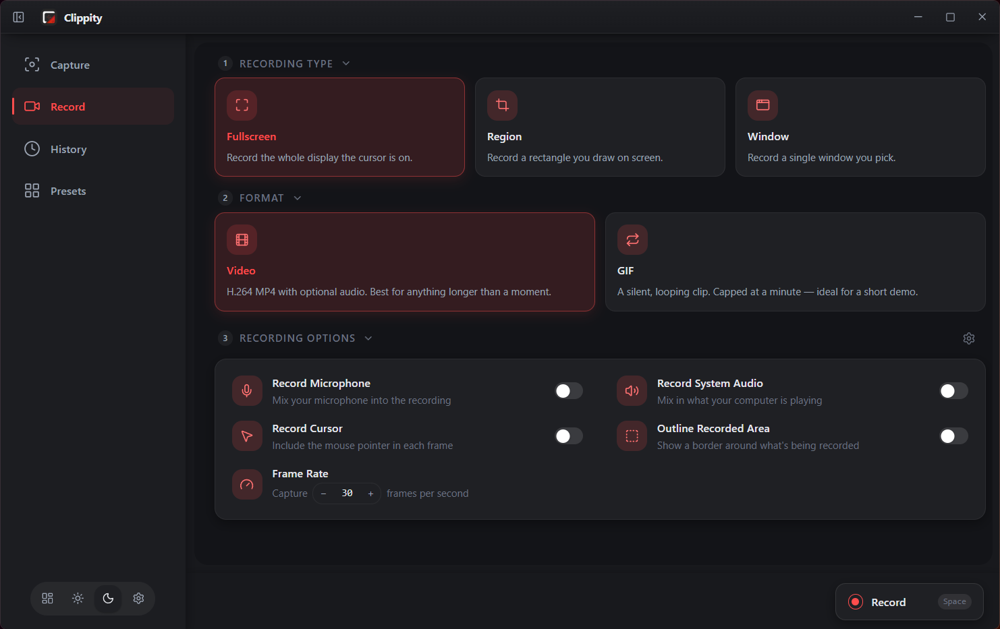
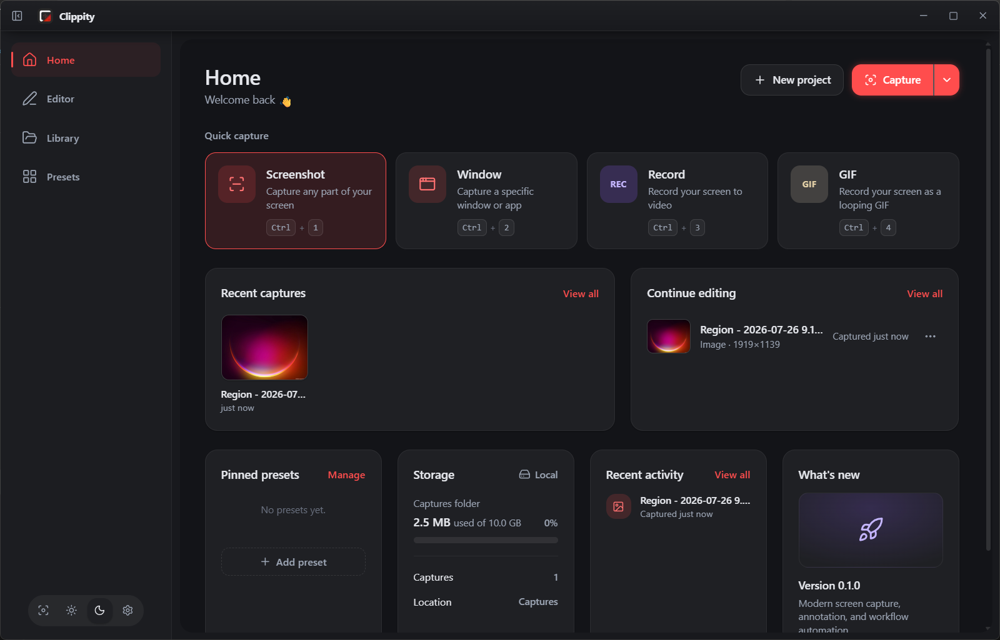
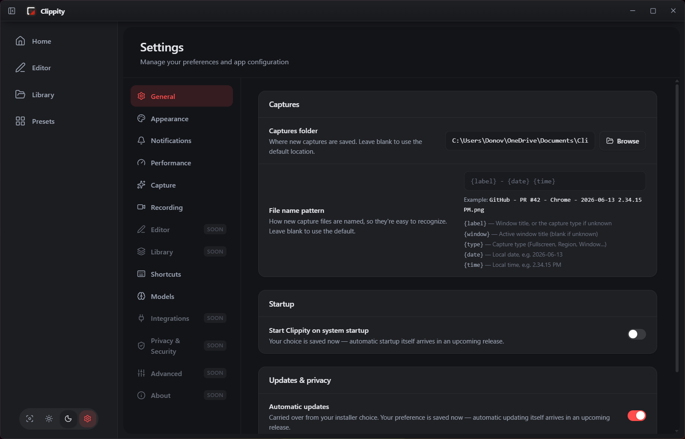

<div align="center">

<picture>
  <source media="(prefers-color-scheme: dark)" srcset="app/frontend/src/assets/logos/App-dark.png">
  
</picture>

# Clippity

**A private, local-first capture studio for Windows.**

Grab a region, a window, a scrolling page, a color, the text inside an image, or
a screen recording — then annotate it in a real layered editor and keep it in a
library that actually remembers where it came from.

[](https://github.com/Diaxium/Clippity/actions/workflows/ci.yml)
[](LICENSE)


[Features](#features) · [Screenshots](#screenshots) · [Install](#install) · [Build from source](#build-from-source) · [Architecture](#architecture) · [Docs](docs/README.md)

</div>

---

## Why Clippity

Most capture tools ask you to choose between *fast* and *capable*, and a lot of
them ask for an account before they'll let you keep a screenshot.

Clippity's capture, OCR, object detection, and image processing all run natively
on your machine — a Rust core behind a [Tauri v2](https://tauri.app) shell — and
nothing leaves it. There is no account and no cloud dependency; the app sends no
usage data anywhere today. The only network access in the product is the one you
trigger: downloading an on-device vision model.

- **Everything stays local.** Captures are ordinary files in a folder you pick.
  Metadata rides beside them in sidecars, not in a service you can be locked out of.
- **Capture is more than a rectangle.** Freehand, Bézier pen, magnetic lasso,
  brush, multi-area, scrolling windows, panoramas, colors, palettes, and OCR text
  all come out of the same overlay.
- **The editor is a real editor.** A non-destructive scene graph with layers,
  blend modes, gradients, effects, and a keyboard map borrowed from Figma and
  Illustrator — not four fixed arrow colors.
- **Your captures keep their story.** Every capture records the app and window it
  came from, the mode, the monitor, and the moment, so the library can answer
  "where did this come from?" months later.

## Screenshots

<div align="center">



<em>The capture hub — type, options, and output in one pass.</em>

</div>

|  |  |
| --- | --- |
|  |  |
| **Overlay** — a dimmed snapshot of the desktop with live dimensions, thirds guides, and a magnifier that reads the pixel under the crosshair. | **Editor** — a non-destructive scene: annotate, blur, reframe, then export flattened or keep it editable. |
|  |  |
| **Library** — captures, aux entries, collections, and smart collections, with provenance in the inspector. | **Record** — video or GIF, region/window/screen, with audio, cursor, and frame-rate controls. |

<details>
<summary>More screens</summary>


*Home — quick capture, recent work, storage, and what's new.*


*Settings — every shortcut is remappable, including the OS-global capture hotkey.*

</details>

## Features

### Capture

| | |
| --- | --- |
| **Region, window, fullscreen** | A transparent overlay over a cached desktop snapshot, plus one-shot window and screen grabs. |
| **Selection methods** | Rectangle, freehand, pen/Bézier, magnetic lasso, and brush — all sharing one snapshot. |
| **Multi-area** | Collect several disjoint regions into a single capture. |
| **Scrolling window** | Auto-scrolls a target window and stitches the frames into one tall image. |
| **Panoramic** | Sweep a wide area and stitch it into a single shot. |
| **Grab Text (OCR)** | Native Windows `Media.Ocr` pulls selectable text straight out of the screen. |
| **Object mode** | On-device ONNX object detection proposes the region for you. |
| **Color & palette** | Sample a pixel or pull a whole palette; both land in the library as first-class entries. |
| **Recording** | H.264 + AAC video and GIF from one Media Foundation session — region, window, or screen. |
| **Countdown & delay** | A taskbar-edge timer strip runs before a delayed capture. |
| **Presets** | Save a capture configuration and re-run it from the app or the tray. |

### Edit

A layered, non-destructive editor with more than twenty tools.

- **Shapes, text, arrows, lines, frames, measure, and stamps** (bundled vector icons).
- **Sample regions** — blur, pixelate, and a magnifier loupe that read from the
  image beneath them.
- **Effects** — inner and outer shadow with spread, per-node blend modes,
  freeform and mesh gradients, spotlight page dimming, and window chrome framing.
- **Crop that resizes the page frame**, so the export always matches the canvas.
- **Layers, multi-select, grouping, bounded undo**, and a `?` cheat sheet
  generated from the same keybind registry that dispatches the shortcuts.
- **Save flattened or editable** — a PNG, or the scene as a sidecar you can reopen.

### Organize

- **Library** with grid and list views, fast thumbnails, an inspector, and batch selection.
- **Labels** — tags plus a favorite flag, stored in a sidecar beside each capture.
- **Collections** — named, manually ordered sets, kept as their own document.
- **Smart collections**, trash and restore, and an aux catalog for colors,
  palettes, and grabbed text (entries with no file of their own).
- **Provenance** — source app, window title, capture mode, monitor, and timestamp
  written at the single save choke point.
- The index is a **reconciled SQLite cache**: the files on disk stay the source of
  truth, so moving or deleting one never leaves a phantom entry behind.

### Live on your desktop

- **System tray flyout** with recent captures, quick modes, and preset launching.
- **Global hotkey** — `Ctrl` `Shift` `2` opens the region overlay from anywhere;
  `Ctrl` `1`–`4` fire screenshot, window, record, and GIF. Every binding is
  remappable from Settings.
- **Typed toasts** that tell you what actually happened and hand you the next action.
- **Mica-backed, rounded, transparent windows** on Windows 11, with light/dark
  themes, a custom accent, and reduced-motion support.
- **Capture shield** — every Clippity window is excluded from screen capture, so
  the app can never photograph itself and the overlay opens without waiting for
  its own chrome to disappear.

## Status

Clippity is **0.1.0 and in active development**. The core is real and used daily;
some surfaces are still being finished.

| Area | State |
| --- | --- |
| Still capture, overlay, selection methods, OCR, color/palette, scrolling & panoramic | Complete |
| Recording (MP4 + GIF, region/window/screen) | Complete |
| Library, labels, collections, trash, provenance | Complete |
| Editor scene, tools, effects, export | Complete |
| Presets, tray, toasts, onboarding | Complete |
| Settings | General, appearance, notifications, performance, capture, recording, shortcuts, and models are live; editor, library, integrations, privacy, advanced, and about are placeholders |
| Sharing | Local handoff only — copy, open, reveal, copy path |
| Search | Metadata-oriented; no OCR/semantic search yet |
| Presets as full workflow recipes | Partial |
| Run at startup, auto-update | The preferences persist; the behavior behind them is not wired up yet |
| macOS / Linux | Builds are Tauri-capable, but capture, OCR, and window handling are Windows-specific |

Planned work is tracked per area in [docs/roadmaps/](docs/roadmaps/README.md) —
capture, editor tools, library organization, sharing & export, vision & AI,
performance, accessibility, and security.

> **Not yet audited for release.** There is no signed release channel or auto-update
> path yet, and the security-hardening items in
> [docs/roadmaps/security-privacy.md](docs/roadmaps/security-privacy.md) are open.
> Build it yourself and run it as a developer preview.

## Install

There are no published binaries yet — the first tagged release will attach the
MSI, the NSIS setup, and a portable zip. Until then, [build from source](#build-from-source).

Building produces all three, collected into `build/`:

```bash
pnpm dist
```

| Artifact | Path |
| --- | --- |
| MSI installer | `build/msi/` |
| NSIS setup | `build/nsis/` |
| Portable zip | `build/portable/` |
| Custom wizard | `installer/` — a full Setup / Modify / Update / Uninstall installer, [documented here](docs/installer/README.md) |

## Build from source

### Prerequisites

- **[Node.js](https://nodejs.org/) 22.13+** — required by pnpm 11
- **[pnpm](https://pnpm.io/) 11+** — the only supported package manager (`corepack enable`)
- **[Rust](https://rustup.rs/) 1.78+** with `rustfmt` and `clippy`
- **Tauri v2 system dependencies** — on Windows: MSVC C++ Build Tools and WebView2
  ([Tauri prerequisites](https://tauri.app/start/prerequisites/))

The first native build needs network access: `ort` downloads matching ONNX Runtime
binaries at build time, and a `uv` + Python sidecar is fetched on first launch for
vision features.

### Run it

```bash
pnpm install
pnpm tauri:dev
```

Everything runs from the repository root — one pnpm workspace, one Cargo
workspace, no `cd` into a package.

### Commands

| Command | Does |
| --- | --- |
| `pnpm dev` | Frontend dev server only, in a browser (`http://localhost:1420`). |
| `pnpm tauri:dev` | The full desktop app. |
| `pnpm build` | Production frontend build. |
| `pnpm tauri:build` | Native bundle, collected into `build/`. |
| `pnpm dist` | Bundle + portable zip + staged payload + installer wizard. |
| `pnpm test` | Vitest (frontend + shared) and `cargo test`. |
| `pnpm check` | TypeScript type-check and `cargo check`. |
| `pnpm lint` · `pnpm format` | ESLint + clippy · Prettier + rustfmt. |
| `pnpm bench` · `pnpm bench:check` | Criterion benchmarks and their budget gate. |

Full reference: [docs/development/commands.md](docs/development/commands.md).
The frontend suite alone is 1,398 tests across 122 files, and CI runs the whole
lot on every push.

## Architecture

Clippity is a set of dedicated Tauri windows, each with its own React entry point
rendered from a single HTML file via hash routing. All of them are created up
front so the app can hide to the tray without losing window state.

| Window | Route | Purpose |
| --- | --- | --- |
| Capture | `index.html` | The capture hub, shown at launch. |
| Main | `#/main` | Library, editor, presets, settings. |
| Overlay | `#/overlay` | Transparent full-screen selection surface. |
| Toast | `#/toast` | Transient result notifications. |
| Tray | `#/tray` | Left-click flyout of recent captures. |
| Countdown | `#/countdown` | Pre-capture timer strip. |
| Recorder frame | — | The outline drawn around a region being recorded. |

The Rust side is a layered Cargo workspace — `infra → domain → platform / vision
→ services → src-tauri` — and every interaction across the seam is a typed IPC
call or event whose wire shape is declared once in `@clippity/shared` and mirrored
by the Rust `domain` structs.

```text
Clippity/
├── app/
│   ├── frontend/          clippity-frontend   React 19 · Vite 7 · Tailwind v4 · Zustand · Motion
│   ├── shared/            @clippity/shared    IPC wire contracts (type-only)
│   └── backend/           Cargo workspace
│       ├── crates/
│       │   ├── infra/       config, logging, events, paths
│       │   ├── domain/      types and rules, no I/O
│       │   ├── platform/    Windows APIs — capture shield, chrome, monitors, input
│       │   ├── vision/      ONNX inference and model downloads
│       │   ├── services/    capture, recorder, library, editor, presets, OCR, …
│       │   └── bench/       criterion benchmarks with budgets
│       └── src-tauri/       the Tauri app crate and tauri.conf.json
├── docs/                  documentation — start at docs/README.md
├── installer/             the standalone Setup / Modify / Update / Uninstall wizard
└── scripts/               build collection, payload staging, benchmark budgets
```

Non-obvious decisions are recorded as ADRs in
[docs/decisions/](docs/decisions/README.md) — why the library index is a
reconciled cache, why labels are a sidecar but collections are a document, why
crop resizes the page frame, why recording is one Media Foundation session with
two outputs.

## Tech stack

| Layer | Technologies |
| --- | --- |
| **UI** | React 19, TypeScript 5.8, Vite 7, Tailwind CSS v4, [Motion](https://motion.dev), Zustand |
| **Shell** | Tauri v2 + `dialog`, `opener`, `global-shortcut` plugins |
| **Native core** | Rust — `xcap`, `image`, `arboard`, `windows`, `window-vibrancy` |
| **Recording** | Windows Media Foundation — H.264 + AAC, NV12, fragmented MP4 |
| **Vision / OCR** | ONNX Runtime via `ort` + `ndarray`; Windows `Media.Ocr` |
| **Data** | SQLite (`rusqlite`) index over file-backed captures and JSON sidecars |
| **Quality** | Vitest + Testing Library, ESLint 9, Prettier, clippy, `tracing`, criterion |

## Documentation

Start at [docs/README.md](docs/README.md).

| | |
| --- | --- |
| [Getting started](docs/getting-started/) | Prerequisites, installation, first run, building. |
| [Architecture](docs/architecture/overview.md) | Overview, frontend, backend, IPC, project structure. |
| [Development](docs/development/commands.md) | Commands, conventions, testing, debugging, performance. |
| [Product](docs/product/features.md) | Concepts and the feature inventory. |
| [Decisions](docs/decisions/README.md) | ADRs — the "why" behind non-obvious choices. |
| [Roadmaps](docs/roadmaps/README.md) | Per-area plans and the current-state audit. |
| [Reference](docs/reference/editor-keybinds.md) | Editor and library keybind maps. |

## Contributing

Issues and pull requests are welcome — see [CONTRIBUTING.md](CONTRIBUTING.md) for
the workflow, coding conventions, and what CI checks before a merge.

## License

[MIT](LICENSE) © 2026 Clippity.
